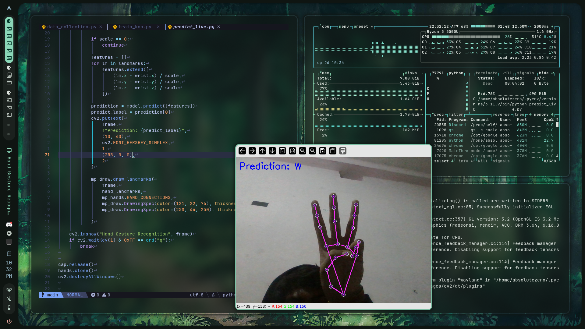

# Hand Sign Language Detection (Hand Landmarks + ML)



This project implements **Hnad sign language detection** (letters / numbers)
using **hand landmarks only** (wrist + fingers), currently without face or body pose.

It uses:
- MediaPipe for hand landmark detection
- Classical Machine Learning (KNN)
- No deep learning
- No image-based training

The system works in **real time** using a webcam.

---

## What this project does

- Detects a single hand from a live camera feed
- Extracts 21 hand landmarks
- Converts landmarks into a **scale- and position-invariant feature vector**
- Trains a classifier on labeled hand poses
- Predicts static signs (e.g. A, B, Y) live

This project supports **static signs only**.

---

## Project structure
├── data_collection.py # Collect labeled hand sign samples
├── train_knn.py # Train KNN classifier on collected data
├── predict_live.py # Real-time sign prediction
├── sign_dataset.csv # Generated dataset (after collection)
├── knn_model.pkl # Trained model (after training)
└── README.md


```yaml

## Requirements

- Python **3.11**
- Webcam
- Linux / macOS / Windows

Python libraries:
- mediapipe
- opencv-python
- numpy
- pandas
- scikit-learn
- joblib
```

